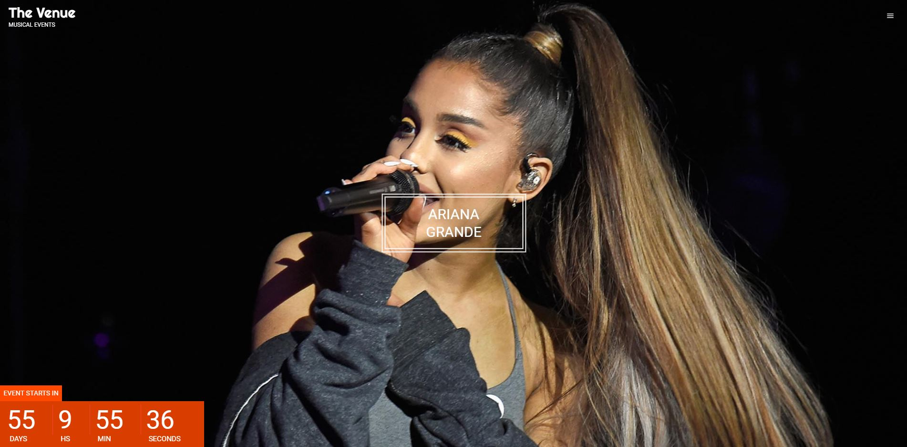
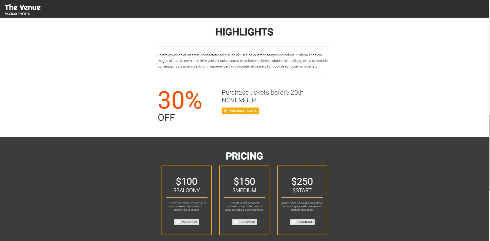

# The Venue App

The main purpose of building this app was to exercise, learn more about React, state, props, passing function and animations.

# Demo
Click the link below to see the app.  
[netlify](https://gifted-swirles-99832d.netlify.com/)

# Preview

## How It Works Locally

After downloading the project to your machine, open it with a prefered text editor and type "npm install" and "npm start" in terminal to run it locally.

# Author

Koray Dündar
